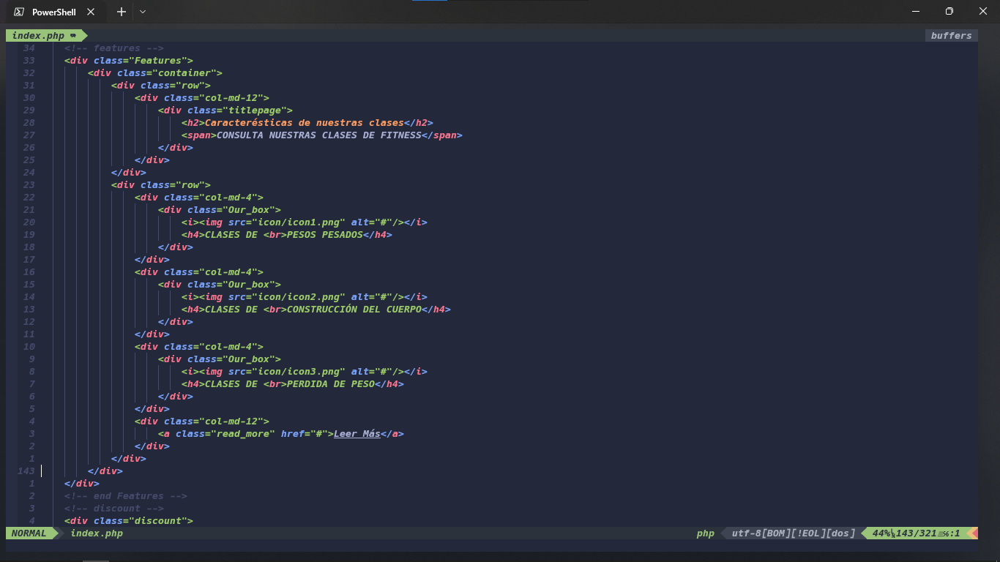
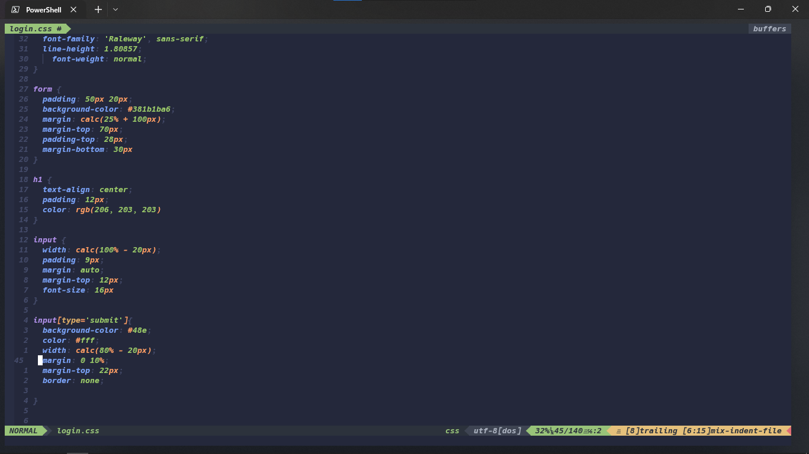

## Neovim Windows
---
### Requisitos de instalación  
Instalar [Scoop](https://scoop.sh/#/)  

    Set-ExecutionPolicy RemoteSigned -Scope CurrentUser # Optional: Needed to run a remote script the first time
    irm get.scoop.sh | iex
 
 
Instalar [NVim](https://neovim.io/) 

    scoop install nvim gcc

Instalar [Noode Js](https://nodejs.org/en/download/)  

    scoop install nodejs

Instala [RipGrep](https://community.chocolatey.org/packages/ripgrep)  

    choco install ripgrep  

### Para configurar NVim  

Clonar repositorio en la direccion *C:\users\usuario\AppData\Local*  

Abrir archivo init.vim con vim  

    vim init.vim

Escribir lo siguiente   

    :PlugInstall

### Resultado Final  

  

> Disfruta :)
